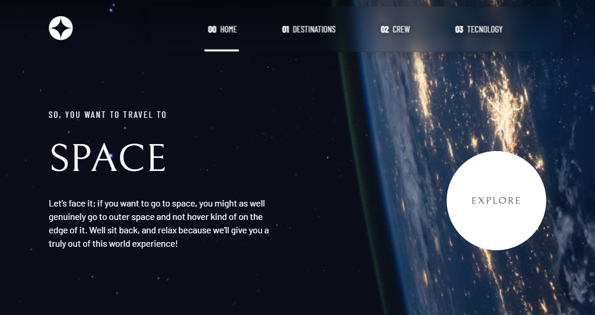
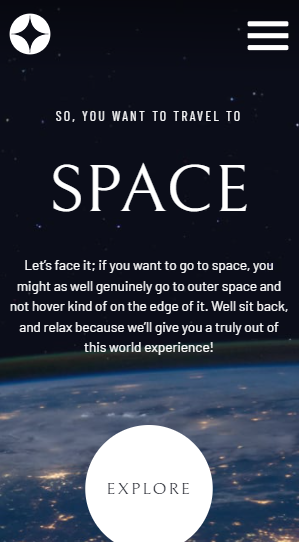

<h1 text-align="center">Space Tourism Multi-page Website</h1>

Um website de turismo espacial.

---

Este projeto foi parte do desafio <a href="https://www.frontendmentor.io/challenges/space-tourism-multipage-website-gRWj1URZ3">Space Tourism Multi-page Website</a> da plataforma FrontEnd Mentor

 <a href="#desafio">O desafio</a> | 
 <a href="#tecnologias">Tecnologias</a> | 
 <a href="#imagens">Imagens</a> | 
 <a href="#links">Links</a> |
 <a href="#redes">Redes</a>

---

### Visão Geral

#### O desafio

O usuário pode:

- Usufruir do layout do aplicativo independente do tamanho da tela (Design Responsivo);
- Ver os estados ativos e com foco dos elementos;
- Ver cada página e poder navegar pelos menus internos.

---

#### Tecnologias

- HTML5 semântico
- Propriedades CSS customizadas
- Flexbox
- SASS Compiler
- Mobile-first Workflow
- JavaScript

---

#### Imagens

<h4>Identidade visual para desktop</h4>

<h4>Identidade visual para mobile e tablet</h4>

---
#### Links

<a href="https://oliverids.github.io/space-tourism-website/" target="_blank">Live Site URL</a>

#### Redes

Perfil do FrontEnd Mentor - <a href="https://www.frontendmentor.io/profile/oliverids">@oliverids</a>

